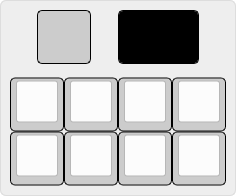

# Hakase
⚠️ WORK IN PROGRESS ⚠️  

IoT macro pad. Thought that internet-connected lightbulbs were a bad idea? Well I internet-connected a keyboard.  
Basically a normal macro pad that can interface with your smart home.  

## Current status

### Done
+ Base keyboard layer
+ Layer with serial output
+ ESPhome (ESP8266)
+ Home Assistant blueprint

### To Do
+ Display
+ Encoder
+ Get the hardware out of prototype stage and make a PCB

## Serial output
The baud rate can be configured in `config.h`, the default is `#define SERIAL_BAUD 9600`.  
As an example, the format of the data for a single tap of the first key is:

| **Byte**   | 1st | 2nd | 3rd | 4th |
|------------|-----|-----|-----|-----|
| **Output** | 0   | 0   | T   | \n  |

The serial layer outputs (with the default 8-key UART layer) 4 bytes when the key is tapped, held, double-tapped, or held after a tap, and after their release. It handles invalid tap dances (triple tap, triple hold, etc) with an invalid code, and in that case it doesn't output a release code.  
The first 2 bytes are the number of the key (by default, 00 to 07). The fourth is always a newline. The third byte contains the type of press:

| **Code** | **Description**                      |
|----------|--------------------------------------|
| T        | Tap                                  |
| H        | Hold                                 |
| D        | Double-tap                           |
| B        | Both (double tap ending with a hold) |
| R        | Release                              |
| X        | Invalid                              |

## Hakase's entity on Home Assistant
ESPhome exposes a text sensor/action entity to Home Assistant with the key code. The included blueprint parses the code and runs the action picked by the user.  
Due to limitations of Home Assistant, I can't add accordions or anything like that to make the blueprint easier to look at.  

## Adding more serial output keys
1. Add new codes in `uart_tap_dance.h` inside the `dance_kcodes` enum.  
2. In `uart_tap_dance.c` add elements in the `tap_dance_actions` array, one for each of the new codes. They contain the `ACTION_TAP_DANCE_FN_ADVANCED` macro that accepts three functions as parameters (first tap of the key, end of tap dance, and release).  
    + Those functions can't have parameters: basically, it means you'll have to repeat a lot of code with differently named functions. Solving this would require changes to the QMK code, so **this is out of my and your control** (unless you feel like making a pull request to QMK). With that said, since the use case allowed it, I tried to minimize the issue, check the functions I wrote.  
3. Add the keys to the keymap using `TD(keycode)`.  
4. Add input boxes, code variables, and triggers to `hakase_blueprint.yaml`.  

## Adding more press types
1. Add new codes in `uart_tap_dance.h` inside the `td_state_t` enum.
2. In `uart_tap_dance.c` adjust the switch-cases in both the `curr_dance()`, `dance_reg_switching()`, and `uart_data_code()` functions.
3. Add input boxes, code variables, and triggers to `hakase_blueprint.yaml`.  
